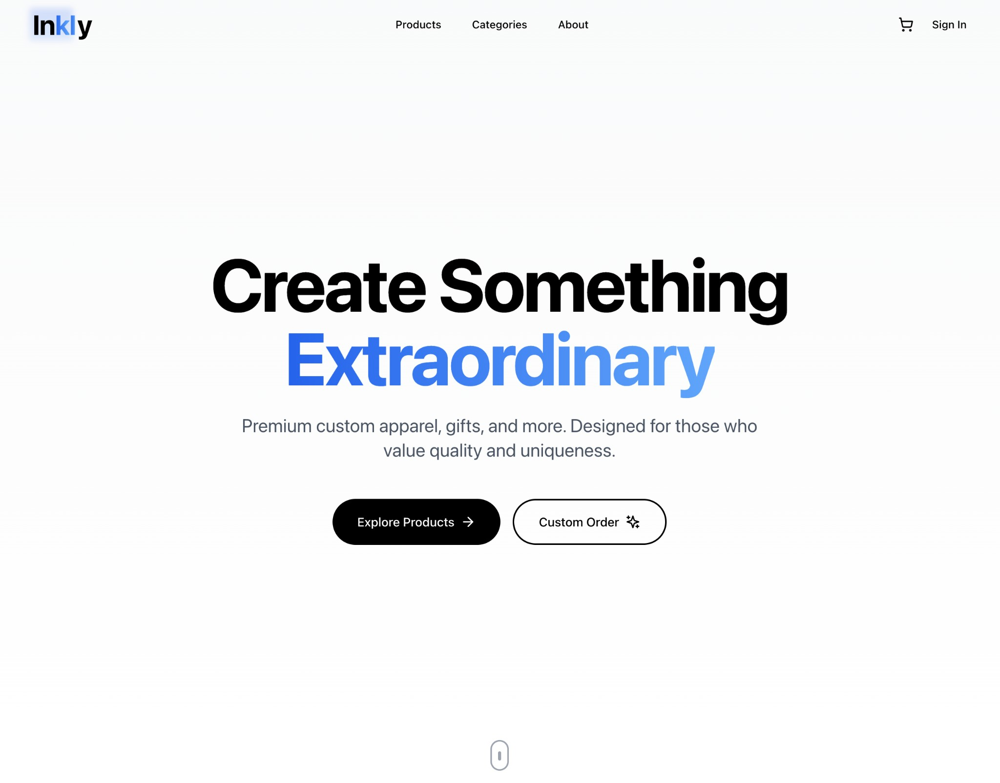

# Inkly - Custom Apparel, Gifts & More

Premium e-commerce platform built with Next.js and NestJS.



**🚨 Docker is MANDATORY - This project runs entirely in Docker containers.**

## Quick Start

```bash
# 1. Clone repository
git clone <repository-url>
cd Inkly

# 2. Start everything
./start-docker.sh

# 3. Seed database (optional)
docker-compose exec backend npx ts-node prisma/seed.ts
```

That's it! Visit:
- **Frontend**: http://localhost:3000
- **Backend API**: http://localhost:3001/api
- **API Docs**: http://localhost:3001/api/docs

**For production deployment with custom domains** (www.inkly.co.in, gamma.inkly.co.in), see **`docs/CLOUDFLARE_SETUP.md`** and **`docs/DEPLOY_GITHUB.md`**.

## Frontend-Backend Communication

✅ **Frontend is connected to backend!**

- **Frontend API Client**: `inkly-frontend/lib/api.ts`
- **Backend URL**: `http://localhost:3001/api` (configured in `docker-compose.yml`)
- **Automatic token injection** for authenticated requests
- **All API calls** go through the centralized API client

## Project Structure

```
Inkly/
├── docker-compose.yml      # Docker configuration
├── start-docker.sh         # Main setup script
├── README.md              # This file
├── inkly-backend/          # Backend API
│   ├── README.md          # Backend documentation
│   └── docs/              # Detailed backend docs
└── inkly-frontend/         # Frontend app
    ├── README.md          # Frontend documentation
    └── docs/              # Detailed frontend docs
```

## Essential Commands

```bash
./start-docker.sh                    # Start all services
docker-compose down                  # Stop services
docker-compose logs -f              # View logs
docker-compose exec backend npx ts-node prisma/seed.ts  # Seed database
```

## Prerequisites

- Docker and Docker Compose
- Git

That's it! Everything runs in Docker.

## Production

```bash
cp .env.prod.example .env.prod
# Edit .env.prod, then:
./deploy.sh
```

See **PRODUCTION.md** for details.

## Documentation

- **Backend**: `inkly-backend/README.md`
- **Frontend**: `inkly-frontend/README.md`
- **Production**: `PRODUCTION.md`
- **Deploy & public URL**: `docs/DEPLOYMENT_OPTIONS.md`
- **Buy inkly.co.in & deploy**: `docs/DOMAIN_AND_DEPLOY.md`
- **Public URLs (www.inkly.co.in, gamma.inkly.co.in)**: `docs/PUBLIC_URLS.md`
- **2-stage deploy (Gamma → Prod)**: `docs/DEPLOY_GITHUB.md`
- **Free deploy (no domain)**: `docs/DEPLOY_FREE.md`
- **Detailed docs**: See `docs/` in each service
